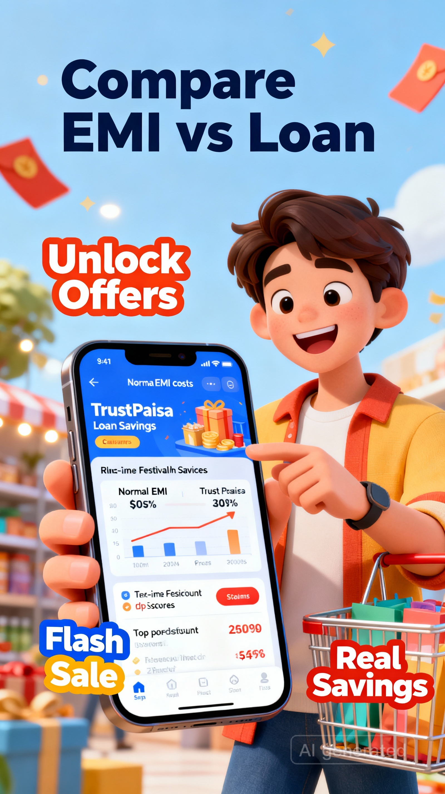
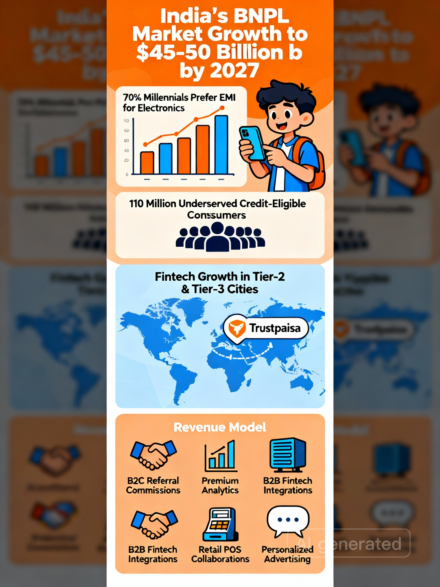
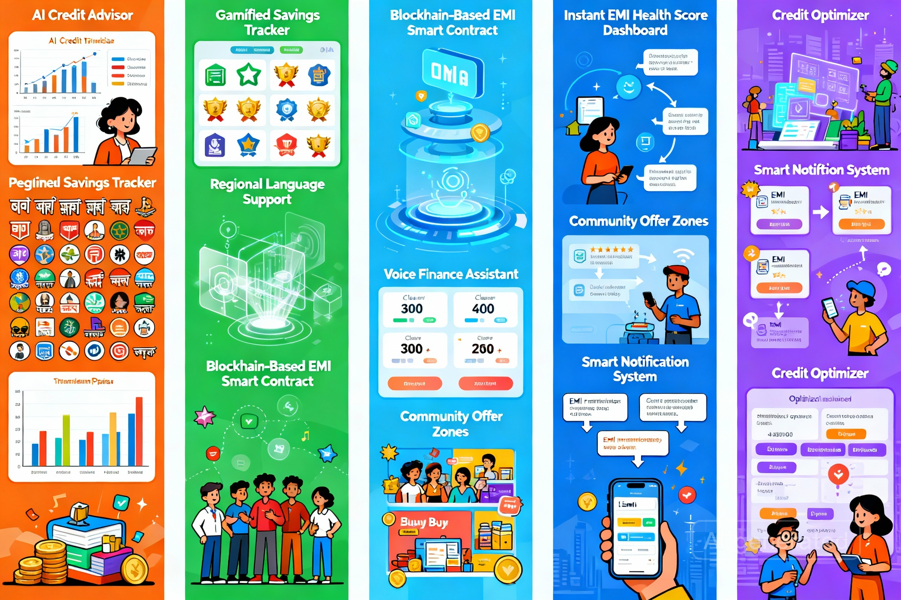

# Case study 

## 💰 Trustpaisa — Smart Savings on Every Purchase  

---

## 🧾 Overview

**Trustpaisa** is a fintech platform redefining how users shop, save, and manage their finances.  
It empowers people to make **smart purchase decisions** by transparently showing how much they can **save through EMI-linked offers**, **discounted rates**, and **real-time financial insights**.  

> ✨ *Trustpaisa bridges the gap between desire and affordability — helping everyone buy smart, spend smart, and save more.*

---

## 💭 The Story – The Spark  

<table>
<tr>
<td width="50%" align="center" valign="middle">

</td>
<td width="60%" valign="top">

### 💸 The Observation  
Most consumers in emerging markets, especially millennials and first-time earners, hesitate before making large purchases.  
Even with growing digital payment options, **financial anxiety** and **lack of transparent EMI comparisons** often stop them from buying.  

Example: A watch costs ₹20,000. The buyer has ₹10,000 now. EMI options seem confusing — hidden charges, unclear interest, uncertain savings.  
They abandon the purchase.  

> **Insight:**  
> People don’t just need *loans* —
> they need *clarity and confidence* in their buying power.

</td>
</tr>
</table>

---

## 💡 The Innovation  
   
###  The Core Idea  

Most people buy products through EMI without realizing how much extra they’re paying.  
At the same time, many **miss out on huge festival discounts** because they don’t have enough ready cash.  

**TrustPaisa** solves both problems.  

It’s a **smart offer + loan comparison platform** that helps users:  
- 🔍 Compare normal EMI vs TrustPaisa loan total cost  
- 🎁 Unlock real-time offer prices from top stores  
- 💸 Buy products instantly during flash or festival sales  
- 💡 See their **actual savings**, not just discounts  

---

## 🧩 Scenario 1 — EMI vs TrustPaisa Comparison  

| Parameter | Traditional EMI | TrustPaisa Loan |
|------------|----------------|-----------------|
| Product Price | ₹60,000 | ₹60,000 |
| User’s Budget | ₹30,000 | ₹30,000 |
| Loan Amount | ₹30,000 | ₹30,000 |
| Interest | ₹10,000 | ₹5,000 |
| **Total Payment** | ₹70,000 | ₹65,000 |

### ✅ **You Save** — ₹5,000 

**Result:**  
Instead of paying ₹70,000 through EMI, the same user pays only ₹65,000 with **TrustPaisa Loan** — saving ₹5,000 effortlessly.  

> 💡 *TrustPaisa = Smarter loan, lesser cost, clearer decision.*

</td>
</tr>
</table>

---

## 🧩 Scenario 2 — Real-Time Offer + Smart Loan  

Imagine a mobile with **MRP ₹30,000**.  
During a **festival offer**, it drops to **₹15,000**.  
But you don’t have ₹15,000 in hand.  

Here’s how TrustPaisa helps 👇  

| Step | Description |
|------|--------------|
| 1️⃣ | You find the **offer price ₹15,000** in e-commerce app |
| 2️⃣ | You choose **TrustPaisa Loan ₹15,000** (interest ₹5,000) |
| 3️⃣ | You instantly buy the product at the offer price |
| ✅ | **Total Payment = ₹20,000** for a ₹30,000 mobile |

### 💰 **You Save ₹10,000!** 

**Result:**  
Even without full cash, TrustPaisa lets you grab the **best-time offer** and still save ₹10,000 compared to regular MRP.  

---

## 🎯 Why TrustPaisa  

| Feature | What It Does | Benefit |
|----------|---------------|----------|
| 💸 **Smart Loan Comparison** | Shows EMI vs TrustPaisa total cost | Helps users save on repayment |
| 🏷️ **Offer Price Discovery** | Finds real-time product discounts | Lets users buy at best price |
| ⚡ **Instant Purchase Option** | One-tap “Buy Now” with TrustPaisa loan | No delay during offers |
| 📊 **Savings Visualization** | Graphically shows actual savings | Gives financial clarity instantly |

---

<table>
<tr>
<td width="50%" align="center" valign="middle">

</td>
<td width="60%" valign="top">

## 🧠 How It Works  

1. Enter product price & available budget  
2. TrustPaisa displays:  
   - Traditional EMI total  
   - TrustPaisa loan total  
   - Real-time offer prices (if available)  
3. Compare → Choose → Buy → Save  

---

## ✨ Key Features  

- 💵 **Smart Offer Calculator** – Displays exact interest, EMI, and total payable amount.  
- 🛍️ **Category Explorer** – Browse items like watches, mobiles, and appliances at discount rates.  
- 📉 **Instant Savings Insight** – See “You saved ₹X” between market price and EMI-based purchase.  
- 🧾 **Transparent EMI Breakdown** – No hidden charges; every rupee visualized.  
- 🔍 **Smart Filters** – Sort by savings %, interest rate, or tenure.  
- 🧠 **AI Deal Advisor** – Recommends best-value offers based on your budget.  
- 💬 **Financial Literacy Nudges** – Micro tips about credit health and smart financing.

</td>
</tr>
</table>

---

## 🧩 Prototype Flow  

1. **Home Page** → Curated deal categories (Watches, Mobiles, Lifestyle).  
2. **Offer List** → Shows product price, discount rate, and EMI options.  
3. **Calculator View** → User enters the amount they can pay now (e.g., ₹10,000).  
4. **Smart Comparison Engine** → Displays interest (₹2,000), total pay (₹12,000), and actual savings (₹8,000).  
5. **Buy Smart Screen** → Redirect to partner platforms with full transparency.  
6. **Track My EMI** → Manage ongoing EMIs and get reminders.  

🧮 Trustpaisa turns confusing financial math into instant visual clarity.

> ## ⚡ Demo prototype: [link](https://raguram-n.github.io/Trustpaisa-Smart-Savings/)

---

## 💡 Benefits  

- 🔍 **Transparency** – Shows users exactly how much they’re paying vs saving.  
- 💰 **Empowered Purchases** – Encourages informed financial behavior.  
- ⚡ **Faster Decision-Making** – Reduces buyer hesitation with clarity-driven UX.  
- 📊 **Financial Inclusion** – Builds trust among first-time credit users.  
- 🧠 **Awareness & Literacy** – Makes people smarter with money.

---

## 🎯 Target Audience  

### 👩‍💼 Young Working Professionals  
- Age 22–35, urban and semi-urban users.  
- Actively buy gadgets, fashion, and home items via EMIs.  

### 🧑‍🏫 Students & First-Time Earners  
- Learning financial discipline and deal evaluation.  

### 🏦 Partner Fintechs & E-Commerce Platforms  
- Use Trustpaisa’s API to enhance transparency for their users.  

### 🧑‍🤝‍🧑 Middle-Income Families  
- Use comparison tools to plan affordable monthly purchases.

---

## 📊 Market Opportunity  

- 💹 India’s **BNPL (Buy Now Pay Later)** market is projected to reach **$45–50 billion by 2027**.  
- 📱 70% of millennials prefer EMI options for electronic purchases.  
- 💳 Over **110 million credit-eligible consumers** remain underserved due to lack of transparent financial guidance.  
- 🌍 Fintech inclusion in Tier-2 and Tier-3 cities is growing rapidly, opening new customer bases.  

> **Trustpaisa** isn’t just riding the fintech wave — it’s guiding users to *ride it smartly.*

---

<table>
<tr>
<td width="50%" align="center" valign="middle">

</td>
<td width="60%" valign="top">

## 💰 Revenue Model  

### 🧭 1. B2C Model  
- **Referral Commissions** – From partner e-commerce and BNPL platforms.  
- **Premium Analytics** – Paid insights for heavy users (budget tracking, EMI planning).  

### 🏦 2. B2B Partnerships  
- **Fintech Integrations** – Embed Trustpaisa’s calculator API on partner sites.  
- **Retail Collaborations** – Offline merchants display smart-savings pop-ups at POS.  

### 💡 3. Advertising & Insights  
- **Personalized Offers** – Data-driven ads with transparent finance-first approach.  
- **Aggregated Analytics Dashboard** – Credit trend insights for partner institutions.

</td>
</tr>
</table>

---

### 📈 Example Revenue Projection  

| Revenue Stream | Year 1 | Year 2 | Year 3 | Growth |
|----------------|--------|--------|--------|--------|
| Affiliate Commissions | ₹30L | ₹80L | ₹1.6Cr | 166% |
| Fintech Partnerships | ₹20L | ₹60L | ₹1.2Cr | 200% |
| Premium Subscriptions | ₹5L | ₹15L | ₹40L | 166% |
| **Total Estimated Revenue** | **₹55L** | **₹1.55Cr** | **₹3.2Cr** | — |

> 💡 *Trustpaisa converts every financial transaction into a transparent and empowering experience.*

---

## 🧱 Tech Stack (Concept Stage)

| Layer | Technology |
|--------|-------------|
| 🎨 Frontend | React + Tailwind CSS |
| ⚙️ Backend | Flask / Node.js |
| 🗄️ Database | Firebase / MongoDB |
| 🔗 APIs | Offer Price Tracker, EMI & Loan Comparison Engine |
| 🤖 Future AI Module | Predictive Offer Alerts + Savings Optimizer |

---

## 🧭 Roadmap  

- [ ] Build loan comparison engine  
- [ ] Integrate offer scraping APIs  
- [ ] Add EMI calculator with visualization  
- [ ] Launch mobile app version  
- [ ] Introduce AI-powered “Smart Offer Alerts”  

---

## 🚀 Future Scope  

- 🤖 **AI Credit Advisor** – Personalized finance insights for every user profile.  
- 📱 **Gamified Savings Tracker** – Turn financial discipline into daily rewards.  
- 🌍 **Regional Language Support** – Enable access across India’s linguistic diversity.  
- 🔐 **Smart Security Layer** – Blockchain-based transparency in EMI contracts.  
- 💬 **Voice-based Finance Assistant** – For users with low digital literacy.

---

## 🧭 Feature Enhancement Scope  

- 🪙 **Instant EMI Health Score** – Shows how affordable each EMI is based on user budget.  
- 💡 **Community Offers Zone** – Group-buy discounts powered by social referrals.  
- 🧾 **Smart Notification System** – EMI reminders + next best offer tips.  
- 🔍 **Credit Optimizer** – Suggests better loan or EMI plans automatically.

---

---

## 🏁 Conclusion  

**Trustpaisa** isn’t just another fintech app — it’s **a financial companion for the modern buyer**.  
By combining **transparency**, **personalization**, and **smart savings visualization**, it empowers people to take control of their purchases without financial fear.  

> “At Trustpaisa, we don’t  help you to just buy — we help you to smart buy.”

---

## 🚀 Vision  

> “To empower every Indian buyer with *financial clarity* — to see, compare, and save before spending.”

---

### ✍️ Author  

**RAGURAM NARAYANASWAMY**  
QA | UX Research | Growth Strategy | Product Management  

---

